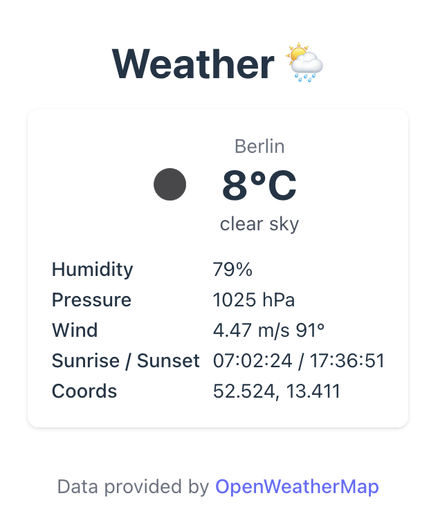

# Fullstack Demo: React 19 + Rust + PostgreSQL

A fully containerized fullstack application with React 19 frontend and Rust API backend 🦀 which can be used as template.

<p align="center">
  
</p>


```text
┌─────────────┐     HTTP/JSON      ┌────────────────────────────────────┐
│   Browser   │ ─────────────────► │   Frontend                         │
│             │                    │   (React 19 + Vite)                │
│             │ ◄───────────────── │   (Dev: Vite; Prod: Nginx static)  │
└─────────────┘                    └────────────────┬───────────────────┘
                                                    │ API calls
                            ┌───────────────────────▼───────────────────────────────┐
                            │               Rust Backend (axum)                     │
                            │  Dev: cargo run (or cargo watch)                      │
                            │  Prod: built binary copied into a slim runtime image  │
                            └───────────────────────┬───────────────────────────────┘
                                                    │
                                        ┌───────────▼────────────┐
                                        │     PostgreSQL DB      │
                                        │   (Postgres container) │
                                        └────────────────────────┘
```

## Services

| Service | Port | Tech |
|---------|------|------|
| Frontend (dev) | 5173 | React + Vite |
| Frontend (prod) | 3000 | React static (served by Nginx) |
| Backend | 8080 | Rust (axum) |
| Database | 5432 | PostgreSQL |

## Quick Start

- obtain an API key from [Openweathermap](https://openweathermap.org/)

```bash
cp .env.example .env
vim .env # paste your Openweathermap API key

# Start all services
docker compose up -d

# Or (for development)
docker compose -f docker-compose.yml -f docker-compose.dev.yml up -d

# Stop services
docker compose down
```